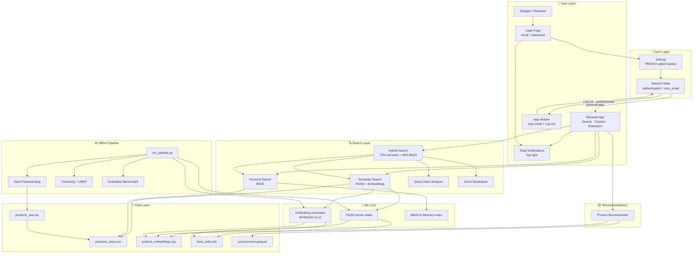

# Architecture Diagram — Semantic Product Search Engine

This document explains **how the application is built** in plain language, including login, notifications, and search.

---

## What This Application Does (In One Sentence)

It is an **e-commerce product search engine** with **secure login**, **toast notifications**, and search that finds products by **meaning** (not just exact keywords), blending semantic and keyword retrieval in a Streamlit web UI.

**Real-world analogy:** Like Amazon search when you type *"something cozy for better sleep"* — you don't know the product name, but the system understands intent. Access requires signing in first; feedback appears as top-right toast messages.

---

## High-Level Architecture



---

## Layer-by-Layer Explanation

### 1. User Layer (What people interact with)

| Component | File | Role |
|-----------|------|------|
| **Login page** | `app.py` → `login_page()` | Default route; email + password; sidebar hidden |
| **App header** | `app.py` → `render_app_header()` | Shows signed-in email + **Log out** |
| **Search / Clusters / Evaluation** | `app.py` | Protected pages — only after login |
| **Toast notifications** | `src/notifications.py` | Top-right feedback for login, search, logout |

**Route protection rule:** Before login, the only screen is Login. Search, Clusters, and Evaluation are blocked until `st.session_state.authenticated` is `True`.

**Example:** User opens the app → sees Sign in → enters email/password → toast “Welcome back…” → header + Search page appear.

---

### 2. Auth Layer (Security)

| Component | File | Role |
|-----------|------|------|
| **Credential store** | `src/auth.py` | Email → `salt:hash` (PBKDF2-HMAC-SHA256) |
| **Verify login** | `verify_credentials()` | Hash typed password + compare digests (no decrypt) |
| **Session** | Streamlit `session_state` | `authenticated`, `user_email` |

**Important:** Passwords are **never** stored or shown as plain text. Login hashes the entered password and compares it to the stored hash.

---

### 3. Search Layer (Retrieval)

| Component | File | Role |
|-----------|------|------|
| **Hybrid Search** | `src/hybrid_search.py` | Combines semantic + keyword scores |
| **Semantic Search** | `src/vector_search.py` | FAISS nearest neighbors |
| **Keyword Search** | `src/bm25_search.py` | BM25 text matching |
| **Query Intent** | `src/query_intent.py` | Detects category and query style |
| **Explanations** | `src/search_explanation.py` | Why each result ranked |

| Query type | Best mode | Example |
|------------|-----------|---------|
| Intent / natural language | Semantic / Hybrid | *"warm jacket for winter trip"* |
| Exact SKU / model | BM25 / Hybrid | *"USB-C 65W laptop charger"* |
| Mixed | Hybrid | *"gift for toddler birthday party"* |

---

### 4. ML Core

| Component | Technology | Purpose |
|-----------|------------|---------|
| Embedding model | `all-MiniLM-L6-v2` | Text → 384-dim vectors |
| FAISS | `IndexFlatIP` | Fast similarity (cosine via normalized vectors) |
| BM25 | `rank-bm25` | Keyword relevance |

---

### 5. Data Layer (No database)

```
data/products_clean.csv            → Product catalog
embeddings/product_embeddings.npy  → Pre-computed vectors
embeddings/faiss_index.bin         → Search index
embeddings/cooccurrence.parquet    → "Also viewed" pairs
reports/evaluation_results.csv     → Benchmark metrics
visuals/cluster_visualization.png  → UMAP plot
```

Credentials live in code as **hashed digests** in `src/auth.py` (not in CSV).

---

### 6. Offline Pipeline

Run: `python scripts/run_pipeline.py`

| Step | What happens |
|------|----------------|
| 1 | Generate 800 synthetic products |
| 2 | Clean data, create `search_text` |
| 3 | Encode embeddings |
| 4 | Build FAISS index |
| 5 | KMeans + UMAP visualization |
| 6 | Evaluate BM25 vs Semantic vs Hybrid |

---

### 7. Notifications Layer

| Event | Toast type | Message example |
|-------|------------|-----------------|
| Login success | success | Welcome back, admin@valere.io! |
| Login failed | error | Invalid email or password. |
| Logout | info | You have been logged out. |
| Search with results | success | Found 10 result(s) for your search. |
| Empty search | warning | Please enter a search query. |

Toasts are pinned to the **top-right** via CSS in `inject_toast_styles()`.

---

## Component Dependency Map

```
app.py
 ├── auth.py                    → login gate
 ├── notifications.py           → toasts (top-right)
 ├── HybridSearch ──┬── VectorSearch ── EmbeddingGenerator
 │                 └── KeywordSearch
 ├── ProductRecommender ── EmbeddingGenerator
 └── Clusters / Evaluation pages (static files)

scripts/run_pipeline.py
 ├── DataPreprocessor
 ├── EmbeddingGenerator
 ├── VectorSearch
 ├── ProductClusterer
 └── SearchEvaluator
```

---

## Key Design Decisions

| Decision | Choice | Reason |
|----------|--------|--------|
| Default route | Login page | Restrict app until authenticated |
| Password storage | PBKDF2 salted hash | One-way; cannot reverse to plain password |
| Password in UI | Never shown | Security and UX |
| Feedback | `st.toast` top-right | Non-blocking notifications |
| Embedding model | `all-MiniLM-L6-v2` | Fast on CPU, good quality |
| Default fusion | 70% semantic / 30% BM25 | Intent-heavy e-commerce queries |
| UI framework | Streamlit | Rapid demo without frontend build |

---

## What Is NOT in the Architecture (Yet)

- REST API (FastAPI/Flask)
- Real user database / OAuth
- Real-time catalog updates
- Cloud deployment (Docker, K8s, CI/CD)
- Real behavioral recommendation data

See `docs/ENHANCEMENTS.md` for the roadmap.
