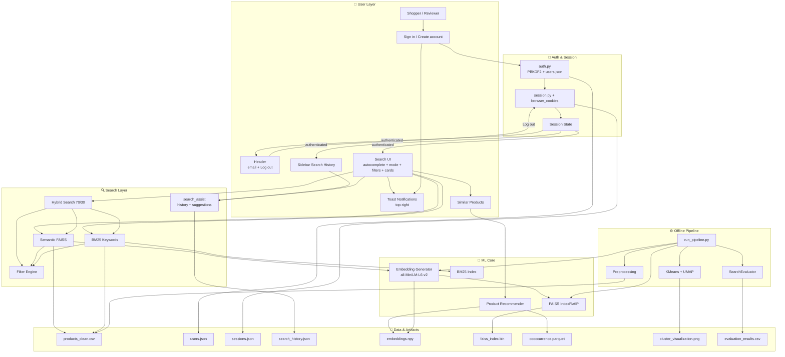

# Architecture Diagram — Semantic Product Search Engine

This document explains **how the application is built** today: sign-in/register, persistent session, a search UI with autocomplete and history, hybrid retrieval, Filter Engine, recommendations, and offline clustering/evaluation artifacts.

---

## What This Application Does (In One Sentence)

An **e-commerce-style product search engine** with **secure accounts and sessions** that finds products by **meaning** (not only keywords), blends semantic + BM25 scores, filters after ranking, assists typing with autocomplete/history, recommends similar items, and keeps clustering/evaluation as **pipeline deliverables** (not sidebar pages).

**Example:** User searches *"warm jacket for winter trip"* → winter clothing appears even when titles don’t use that exact phrase.

---

## High-Level Architecture



---

## Layer-by-Layer Explanation

### 1. User Layer (minimal UI)

| Screen | What the user sees |
|--------|--------------------|
| **Sign in / Create account** | Default route — only pages before auth |
| **Header** | App title, signed-in email, **Log out** |
| **Search sidebar** | Mode + filters + **Search History** |
| **Main area** | Autocomplete search, product cards, similar products |
| **Toasts** | Success / error / warning at top-right |

**Not in the UI (by design):** Clusters page, Evaluation page, score metrics, “Why this result?” panels, weight/top-k sliders.

Those features still exist as **code + files** for the project deliverables.

---

### 2. Auth & Session Layer

| Piece | File | Role |
|-------|------|------|
| Credential store | `src/auth.py` + `data/users.json` | Register + email → `salt:hash` (PBKDF2) |
| Verify | `verify_credentials()` | Re-hash typed password; compare digests |
| Server session | `src/session.py` | Create / touch / idle expire |
| Browser bridge | `src/browser_cookies.py` | Persist session id across refresh |
| UI session | `st.session_state` | `authenticated`, `user_email`, search state |

Passwords are never shown in the UI and never stored as plain text.

---

### 3. Search Layer

| Mode | Module | Role |
|------|--------|------|
| Semantic | `vector_search.py` | Meaning via FAISS |
| BM25 | `bm25_search.py` | Keyword baseline |
| Hybrid | `hybrid_search.py` | Default 70% semantic + 30% BM25 |
| Assist | `search_assist.py` + frontend components | Autocomplete + history |

**Filters (Task 3 / Module 4):** category, price range, minimum rating — applied post-ranking by `filter_engine.py` using Metadata Store (D5: ID, Category, Price, Rating).

**Defaults (fixed in UI):** `top_k = 10`, semantic weight `0.7` (justified in `reports/`).

---

### 4. Recommendations (Task 4)

| Piece | File |
|-------|------|
| Content similarity | `recommender.py` (embeddings) |
| Also-viewed style | Simulated co-occurrence parquet |
| UI | “Similar Products” after picking a result |

---

### 5. Offline Deliverables (not sidebar pages)

| Deliverable | How it’s produced | Where it lives |
|-------------|-------------------|----------------|
| Cluster visualization | `clustering.py` via pipeline | `visuals/cluster_visualization.png` |
| Evaluation table | `evaluation.py` via pipeline | `reports/evaluation_results.csv` |
| Written comparison | docs / reports | `reports/search_comparison.md` |

Run: `python scripts/run_pipeline.py`

---

## Component Dependency Map

```
app.py
 ├── auth.py
 ├── notifications.py
 ├── HybridSearch ── VectorSearch ── EmbeddingGenerator
 │               └── KeywordSearch
 └── ProductRecommender

scripts/run_pipeline.py
 ├── preprocessing
 ├── embedding_generator
 ├── vector_search
 ├── clustering          → visuals/
 └── evaluation         → reports/
```

---

## Key Design Decisions

| Decision | Choice | Why |
|----------|--------|-----|
| Default route | Login | Protect search until signed in |
| UI scope | Search only | Matches brief: “search UI with filters and product cards” |
| Clusters / eval in UI | Removed | Deliverables are image + CSV/reports, not extra pages |
| Hybrid weights in UI | Fixed 70/30 | Cleaner UI; justification in reports |
| Result cards | Title, category, rating, description, price | E-commerce style; no internal score UI |
| Password storage | PBKDF2 salted hash | One-way; no decrypt |

---

## What Is Still Out of Scope

- REST API, Docker/CI, real user DB, real purchase logs  
- Incremental index updates at catalog scale  

See `docs/ENHANCEMENTS.md`.
