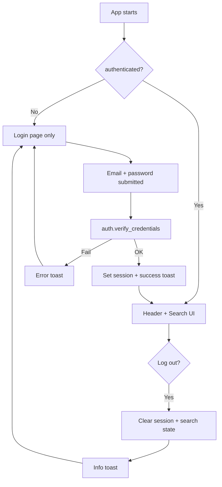
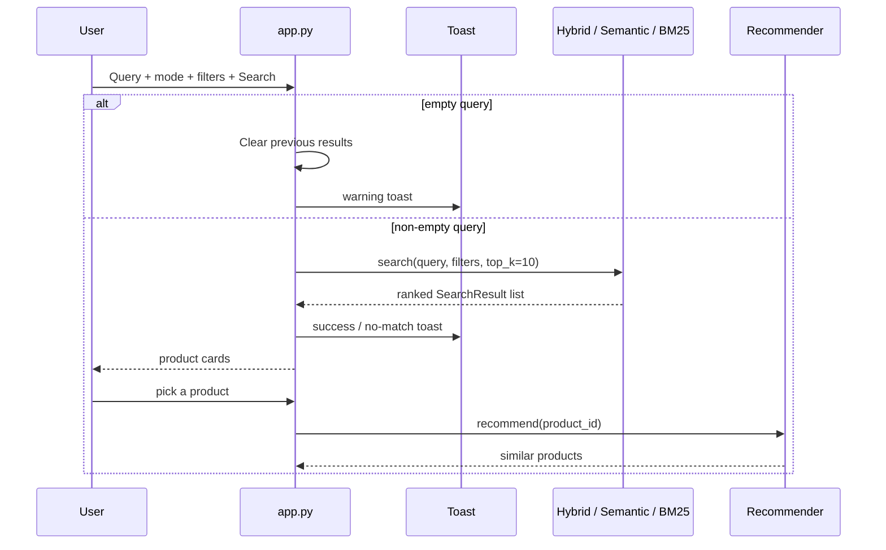
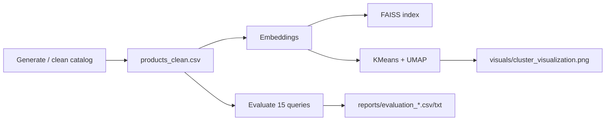

# Data Flow Diagram — Semantic Product Search Engine

How data moves today: **login → search → recommendations**, plus the **offline pipeline** for clusters and evaluation files.

---

## Overview: Three Flows

1. **Auth flow** — login / logout / route protection  
2. **Online search flow** — query → ranked products → similar items  
3. **Offline pipeline** — catalog, embeddings, FAISS, clusters, evaluation reports  

---

## 1. Authentication Data Flow



| Step | Example |
|------|---------|
| Open app | Only Sign in is available |
| Valid login | Session set → Search UI |
| Empty / wrong password | Toast error; stay on login |
| Log out | Back to login; search results cleared |

Passwords: typed → PBKDF2 with stored salt → compare digests (never decrypted).

---

## 2. Online Search Data Flow



### Detailed search path (Hybrid mode)

```
User (logged in)
  Query: "cotton"
  Mode: Hybrid
  Filters: category / price / rating (optional)
      ↓
encode_query → FAISS candidates
tokenized query → BM25 candidates
      ↓
min-max normalize scores
combined = 0.7 × semantic + 0.3 × BM25
      ↓
apply filters (category, price, rating)
      ↓
top 10 product cards
  (title, category, rating, description, price)
      ↓
optional: Similar Products via recommender
```

### Empty query behavior

```
Submit with blank input
  → do NOT reuse previous query
  → clear search_results + search_query from session
  → toast: "Please enter a search query."
  → show empty state
```

---

## 3. How Filters Are Applied

```
Retrieve candidates from semantic and/or BM25
  → keep rows that pass category / price / rating
  → return until top_k filled
```

**Example:** Category = Clothing, min rating = 4.0 → only Clothing products with rating ≥ 4.0 appear.

---

## 4. Recommendation Data Flow

```
User selects a result in “Similar Products”
  → product_id taken from selectbox
  → ProductRecommender.recommend(id)
       ├─ content similarity (embeddings)
       └─ co-occurrence (simulated)
  → show top-N: title, category, price, rating
```

---

## 5. Offline Pipeline Data Flow

**Trigger:** `python scripts/run_pipeline.py`



| Artifact | Used by UI? | Purpose |
|----------|-------------|---------|
| `products_clean.csv` | Yes | Search + filters |
| `faiss_index.bin` / embeddings | Yes | Semantic search |
| `cluster_visualization.png` | No (file deliverable) | Task 4 sanity-check |
| `evaluation_results.csv` | No (file deliverable) | Task 5 metrics table |

---

## 6. Toast Notification Flow

| Event | Behavior |
|-------|----------|
| Login fail / empty fields | Immediate error toast |
| Login success / logout | Queued toast (survives `st.rerun()`) |
| Search with hits | Success toast |
| Search with no hits / empty query | Warning toast |

Position: top-right (`src/notifications.py` CSS).

---

## 7. Startup Sequence

```
1. set_page_config + inject_toast_styles
2. init_auth_state + show_pending_toasts
3. if not authenticated → login_page() STOP
4. render_app_header()
5. load_search_stack() (cached)
6. search_page() — sidebar mode/filters + main search
```

---

## 8. Example End-to-End Trace

**User:** logs in → searches `"warm jacket for winter trip"` (Hybrid) → picks a jacket → sees similar items → logs out.

| Stage | Result |
|-------|--------|
| Auth | Welcome toast; Search unlocked |
| Hybrid search | Intent-style clothing products ranked |
| Cards | Clean product info (no score UI) |
| Recommendations | Similar jackets / winter wear |
| Logout | Info toast; login gate again |

---

## 9. Artifacts Summary

| File | Created by | Consumed by |
|------|------------|-------------|
| `data/products_clean.csv` | Preprocessing | Search, recommender, UI filters |
| `embeddings/*` | Embedding + FAISS build | Vector search, recommender |
| `visuals/cluster_visualization.png` | Clustering | Reviewers / Drive pack (not UI) |
| `reports/evaluation_results.csv` | Evaluation | Reviewers / Drive pack (not UI) |
| Hashes in `auth.py` | Manual setup | Login verification |
