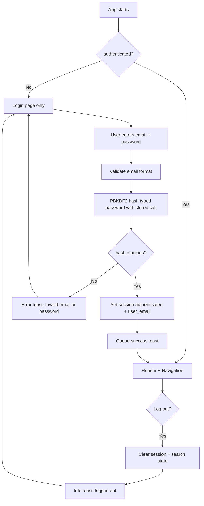
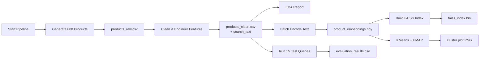
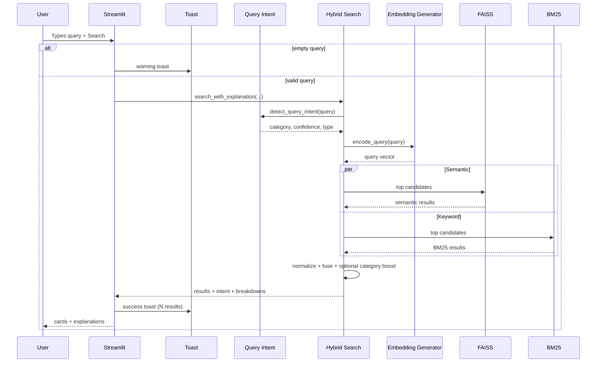

# Data Flow Diagram — Semantic Product Search Engine

This document traces **how data moves** through login, search, notifications, and the offline pipeline.

---

## Overview: Three Main Flows

1. **Auth flow** — Login / logout / route protection  
2. **Offline flow** — Build catalog, embeddings, indexes (run once)  
3. **Online flow** — Authenticated user searches and gets results  

---

## 1. Authentication Data Flow

**Trigger:** User opens the app (`streamlit run app.py`)



### Step-by-step with example

| Step | What happens | Example |
|------|----------------|---------|
| Open app | Only login is reachable | Sidebar hidden |
| Type credentials | Password field is masked | `admin@valere.io` + password |
| Verify | Hash password; compare to `salt:hash` | No plain password stored |
| Success | Session set; toast shown | “Welcome back…” top-right |
| Try Search before login | Blocked | Login page stays |

**Password storage format:**

```
email → "salt_hex:pbkdf2_sha256_digest"
```

Login does **not decrypt**. It re-hashes the typed password and uses constant-time compare (`secrets.compare_digest`).

---

## 2. Offline Data Flow (Pipeline)

**Trigger:** `python scripts/run_pipeline.py`



| Step | Input | Output | Example |
|------|-------|--------|---------|
| Generate | Config (800 products) | Raw CSV | "Men's Winter Puffer Jacket" |
| Clean | Raw CSV | Clean + `search_text` | title + description + category |
| Embed | `search_text` | `.npy` | 800 × 384 floats |
| Index | Embeddings | FAISS binary | Similarity search ready |
| Evaluate | 15 queries | CSV metrics | Hybrid P@5 ≈ 0.91 |

---

## 3. Online Search Data Flow (After Login)

**Trigger:** User clicks **Search** on the Search page



---

## 4. Detailed Hybrid Search Path

```
USER (authenticated)
  Query: "home workout equipment small apartment"
  Filters: optional category / price / rating
      ↓
QUERY INTENT
  Category: Sports & Outdoors
  Type: intent → suggested mode Semantic
      ↓
ENCODE ONCE → float32[384]
      ↓
     ┌───────────────┬───────────────┐
     │ Semantic FAISS│ Keyword BM25  │
     └───────┬───────┴───────┬───────┘
             ↓               ↓
     Min-max normalize scores to [0, 1]
             ↓
     combined = 0.7×semantic + 0.3×BM25
     (+ soft category boost if enabled)
             ↓
     Top-k results + ScoreBreakdown
             ↓
UI cards + optional "Why this result?"
Toast: Found N result(s)
```

---

## 5. Filter Data Flow

Filters apply **after** retrieval:

```
Retrieve candidate pool (top_k × 3 to × 10)
  → keep if category / price / rating match
  → stop when top_k filled
```

**Example:** Filter = Clothing only → global retrieval, then Clothing rows pass.

---

## 6. Recommendation Data Flow

```
User picks product from results
  → content similarity (embeddings)
  → co-occurrence (parquet)
  → blend 60% content + 40% co-occurrence
  → show top 5
```

---

## 7. Toast Notification Data Flow

| Trigger | Path |
|---------|------|
| Immediate (errors, search done) | `toast_error()` / `toast_success()` → `st.toast()` |
| After `st.rerun()` (login OK, logout) | `queue_toast()` → session list → `show_pending_toasts()` on next load |

CSS (`inject_toast_styles`) pins the container to the **top-right** of the viewport.

---

## 8. Startup Data Flow

```
1. set_page_config + inject_toast_styles
2. init_auth_state
3. show_pending_toasts
4. if not authenticated → login_page() and STOP
5. render_app_header()
6. sidebar: Search | Clusters | Evaluation
7. Search page → load_search_stack() (cached) if needed
```

Clusters / Evaluation skip heavy ML load when possible (static PNG / CSV).

---

## 9. Example End-to-End Trace

**User:** opens app → logs in as `admin@valere.io` → searches `"gift for toddler birthday party"`

| Stage | Result |
|-------|--------|
| Auth | Session authenticated; welcome toast |
| Intent | Toys & Games |
| Semantic | Plush, blocks, games |
| BM25 alone | Weak (low P@5 historically) |
| Hybrid | Stronger combined ranking |
| UI | Intent banner + explanations + success toast |
| Logout | Session cleared; info toast; back to login |

---

## 10. Artifacts Summary

| File | Created by | Read by |
|------|------------|---------|
| `products_clean.csv` | Preprocessing | Search, Recommender |
| `product_embeddings.npy` | EmbeddingGenerator | FAISS, Recommender |
| `faiss_index.bin` | VectorSearch | VectorSearch |
| `cooccurrence.parquet` | ProductRecommender | ProductRecommender |
| `evaluation_results.csv` | SearchEvaluator | Evaluation page |
| Hashes in `auth.py` | Manual / tooling | Login verification |
