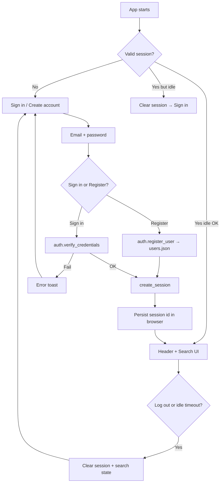
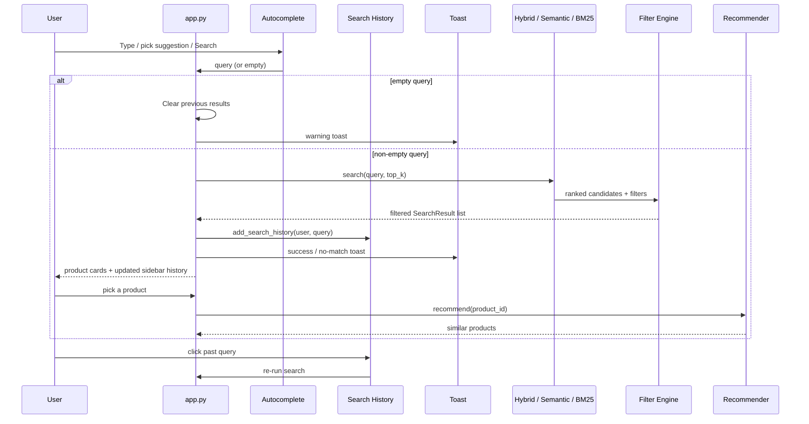
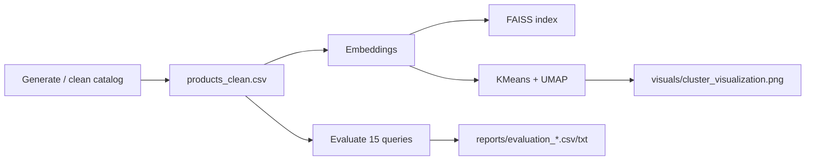

# Data Flow Diagram — Semantic Product Search Engine

How data moves today: **login → search → recommendations**, plus the **offline pipeline** for clusters and evaluation files.

---

## Overview: Three Flows

1. **Auth flow** — login / logout / route protection  
2. **Online search flow** — query → ranked products → similar items  
3. **Offline pipeline** — catalog, embeddings, FAISS, clusters, evaluation reports  

---

## 1. Authentication & Session Data Flow



| Step | Example |
|------|---------|
| Open app | Sign in (or restore session after refresh) |
| Create account | New row in `data/users.json` (hashed password) |
| Valid login | Session file + browser id → Search UI |
| Refresh | Still signed in if not idle-expired |
| Idle timeout | Auto log-out (see `SESSION_IDLE_TIMEOUT_SECONDS`) |
| Log out | Back to sign in; search results cleared |

Passwords: typed → PBKDF2 with stored salt → compare digests (never decrypted).

---

## 2. Online Search Data Flow



### Detailed search path (Hybrid mode)

```
User (logged in)
  Query via autocomplete box (or history click)
  Mode: Hybrid
  Filters: category / price / rating (optional)
      ↓
encode_query → FAISS candidates
tokenized query → BM25 candidates
      ↓
min-max normalize scores
combined = 0.7 × semantic + 0.3 × BM25
ranked results
      ↓
Filter Engine (category, price range, rating via Metadata Store)
      ↓
top 10 product cards
  (title, category, rating, description, price)
      ↓
append query to per-user search history
optional: Similar Products via recommender
```

### Empty query behavior

```
Submit with blank input
  → do NOT reuse previous query
  → clear search_results + search_query from session
  → toast: "Please enter a search query."
  → show empty state
```

### Search history & autocomplete

```
Focus / empty box → recent history suggestions
Type → matching product titles (+ history matches)
Successful search → data/search_history.json updated
Sidebar list → single-line ellipsis + tooltip; scrollable; click to re-run
```

---

## 3. How Filters Are Applied

Aligned with architecture Module 4 / DFD 7.0 Filter Engine:

```
Hybrid / Semantic / BM25 → Ranked Results
  → Filter Engine looks up D5 Metadata Store (ID, Category, Price, Rating)
  → Apply Category Filter
  → Apply Price Range Filter
  → Apply Rating Filter
  → Filtered Results → Result Presentation
```

**Example:** Category = Clothing, min rating = 4.0 → only Clothing products with rating ≥ 4.0 appear (rank order preserved).

Implementation: `src/filter_engine.py` (`FilterEngine` + `MetadataStore`).

---

## 4. Recommendation Data Flow

```
User selects a result in “Similar Products”
  → product_id taken from selectbox
  → ProductRecommender.recommend(id)
       ├─ content similarity (embeddings)
       └─ co-occurrence (simulated)
  → show top-N: title, category, price, rating
```

---

## 5. Offline Pipeline Data Flow

**Trigger:** `python scripts/run_pipeline.py`



| Artifact | Used by UI? | Purpose |
|----------|-------------|---------|
| `products_clean.csv` | Yes | Search + filters |
| `faiss_index.bin` / embeddings | Yes | Semantic search |
| `cluster_visualization.png` | No (file deliverable) | Task 4 sanity-check |
| `evaluation_results.csv` | No (file deliverable) | Task 5 metrics table |

---

## 6. Toast Notification Flow

| Event | Behavior |
|-------|----------|
| Login fail / empty fields | Immediate error toast |
| Login success / logout | Queued toast (survives `st.rerun()`) |
| Search with hits | Success toast |
| Search with no hits / empty query | Warning toast |

Position: top-right (`src/notifications.py` CSS).

---

## 7. Startup Sequence

```
1. set_page_config + inject_toast_styles
2. restore session from browser if present and not idle
3. show_pending_toasts
4. if not authenticated → sign-in / register STOP
5. render_app_header()
6. load_search_stack() (cached)
7. search_page() — sidebar mode/filters/history + autocomplete search
```

---

## 8. Example End-to-End Trace

**User:** registers → searches `"warm jacket for winter trip"` (Hybrid) → sees history entry → picks a jacket → similar items → refreshes (still signed in) → logs out.

| Stage | Result |
|-------|--------|
| Auth | Account created; welcome toast; Search unlocked |
| Hybrid search | Intent-style clothing products ranked → filtered |
| History | Query appears in sidebar immediately |
| Cards | Clean product info (no score UI) |
| Recommendations | Similar jackets / winter wear |
| Refresh | Session restored |
| Logout | Info toast; sign-in gate again |

---

## 9. Artifacts Summary

| File | Created by | Consumed by |
|------|------------|-------------|
| `data/products_clean.csv` | Preprocessing | Search, recommender, UI filters |
| `data/users.json` | Registration / seed | Auth |
| `data/sessions.json` | Login / touch | Session restore + idle check |
| `data/search_history.json` | Successful searches | Sidebar history + autocomplete |
| `embeddings/*` | Embedding + FAISS build | Vector search, recommender |
| `visuals/cluster_visualization.png` | Clustering | Reviewers / Drive pack (not UI) |
| `reports/evaluation_results.csv` | Evaluation | Reviewers / Drive pack (not UI) |
