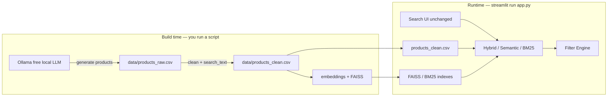

# Free LLM Product Catalog Guide

How the optional **Ollama** catalog generator works, and how to replace the existing CSV used by search — without changing the Streamlit UI, hybrid search, filters, history, or login.

---

## Short answer

| Question | Answer |
|----------|--------|
| When does the LLM run? | Only when **you run a script** (build time) |
| On search? | **No** |
| When Streamlit starts? | **No** |
| What does the LLM write? | Same catalog files the app already uses: `data/products_raw.csv` and `data/products_clean.csv` |
| What happens after? | Rebuild embeddings / FAISS (pipeline or `--rebuild`), then search works as before |

---

## How it fits the existing flow



1. **Today (default):** products come from the **synthetic** generator in `src/preprocessing.py` → CSV → embeddings.  
2. **Optional LLM path:** Ollama invents product rows → **same CSV schema** → same cleaning → same embedding pipeline.  
3. The live app **never calls** the LLM; it only reads CSV + indexes.

---

## CSV schema (unchanged)

LLM output is validated and saved to match what search already expects:

| Column | Required | Notes |
|--------|----------|--------|
| `id` | Yes | Integer, assigned by generator |
| `title` | Yes | Product name |
| `description` | Yes | Short text |
| `category` | Yes | Must be one of the existing app categories (see below) |
| `price` | Yes | Number |
| `rating` | Yes | Number (about 1–5) |
| `search_text` | Yes (clean file) | Built as `title + description + category` by `DataPreprocessor.clean()` |

**Allowed categories** (same as synthetic catalog):

- Electronics  
- Clothing  
- Home & Kitchen  
- Sports & Outdoors  
- Beauty & Personal Care  
- Books & Stationery  
- Toys & Games  
- Health & Wellness  

Files:

- **Raw:** `data/products_raw.csv` — columns above without `search_text`  
- **Clean:** `data/products_clean.csv` — includes `search_text` (this is what FAISS/BM25/UI use)

---

## Prerequisites (free)

1. Install [Ollama](https://ollama.com) for Windows and start it.  
2. Pull a free model (default in config is `llama3.2`):

```bash
ollama pull llama3.2
ollama list
```

3. Activate your project venv and install deps as usual (`pip install -r requirements.txt`).

Config (optional tweaks) in [`src/config.py`](../src/config.py):

| Setting | Default | Meaning |
|---------|---------|---------|
| `OLLAMA_BASE_URL` | `http://localhost:11434` | Local Ollama API |
| `OLLAMA_MODEL` | `llama3.2` | Model name |
| `LLM_CATALOG_DEFAULT_COUNT` | `200` | Default product count |
| `LLM_CATALOG_BATCH_SIZE` | `10` | Products per LLM request |

---

## How to generate / replace the catalog CSV

### Option A — Dedicated script (recommended)

From the project root (venv active):

```bash
# Overwrite products_raw.csv + products_clean.csv with ~200 LLM products
python scripts/generate_catalog_llm.py --count 200
```

Then rebuild indexes (required after catalog change):

```bash
python scripts/run_pipeline.py
```

**One-step generate + rebuild:**

```bash
python scripts/generate_catalog_llm.py --count 200 --rebuild
```

### Option B — Pipeline flag

```bash
python scripts/run_pipeline.py --llm-catalog --count 200
```

This generates via Ollama, cleans the CSV, then rebuilds embeddings, FAISS, clusters, and evaluation.

### Useful flags

```bash
python scripts/generate_catalog_llm.py --count 100 --model mistral
python scripts/generate_catalog_llm.py --count 150 --base-url http://localhost:11434 --rebuild
python scripts/run_pipeline.py --llm-catalog --count 100 --model llama3.2
```

---

## What gets overwritten

| Step | Effect |
|------|--------|
| LLM generate | **Overwrites** `data/products_raw.csv` |
| Clean | **Overwrites** `data/products_clean.csv` |
| Rebuild / pipeline | **Overwrites** `embeddings/*`, cluster visual, eval reports |

Your Streamlit UI code is not changed. After rebuild, restart or refresh the app so it reloads the new indexes (`@st.cache_resource` may need an app restart).

---

## Fallback (no Ollama)

If Ollama is not installed or not running:

```bash
python scripts/run_pipeline.py
```

uses the **synthetic** catalog path (as before). The LLM scripts print a clear error with install / `ollama pull` hints.

---

## Code map

| File | Role |
|------|------|
| [`src/llm_catalog.py`](../src/llm_catalog.py) | Call Ollama, validate rows, write CSV |
| [`scripts/generate_catalog_llm.py`](../scripts/generate_catalog_llm.py) | CLI for generate (+ optional `--rebuild`) |
| [`scripts/run_pipeline.py`](../scripts/run_pipeline.py) | `--llm-catalog` optional; default = synthetic |
| [`src/preprocessing.py`](../src/preprocessing.py) | Clean → `search_text`; synthetic fallback |
| [`app.py`](../app.py) | Unchanged — still loads clean CSV + indexes |

---

## Checklist after generating

1. Confirm Ollama is running (`ollama list`).  
2. Run generate (Option A or B).  
3. Confirm `data/products_clean.csv` has new titles / count.  
4. Rebuild indexes if you did not use `--rebuild` / full `--llm-catalog` pipeline.  
5. Restart Streamlit: `streamlit run app.py`.  
6. Sign in and search — same UI; products come from the new CSV.

---

## Related docs

- [ENHANCEMENT_REPORT.md](ENHANCEMENT_REPORT.md) — Part E (summary)  
- [DATA_FLOW.md](DATA_FLOW.md) — online search still uses CSV + indexes  
- [../README.md](../README.md) — “Optional: Free LLM product catalog”  
